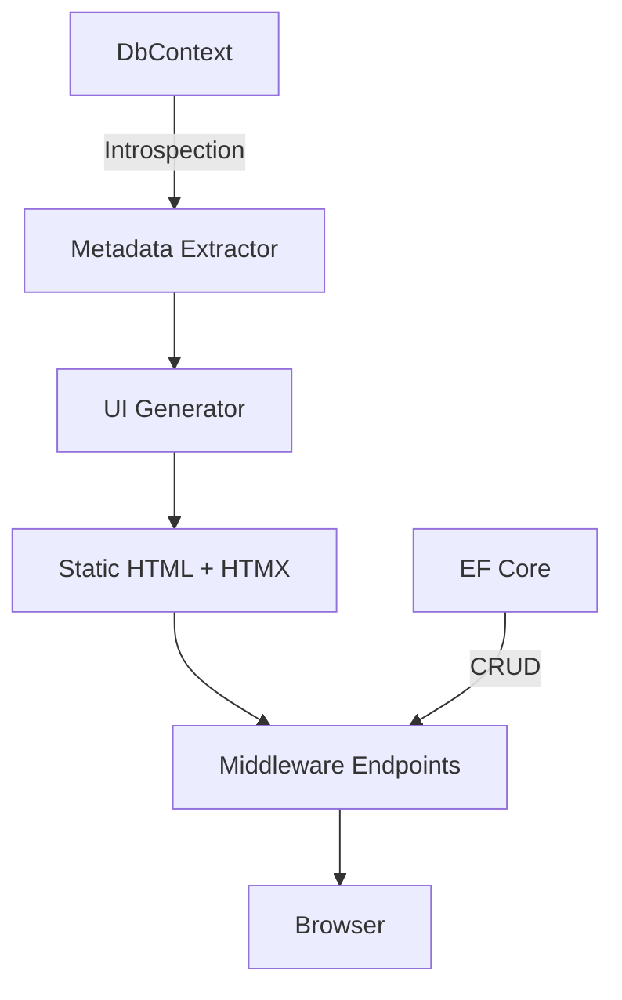

# **EF UI POC: Auto-Generated CRUD UI for Entity Framework**

**Objective**: Build a pluggable .NET middleware that auto-generates a simple, Swagger UI-like interface for CRUD operations on EF Core `DbContext` entities. The UI should support basic POCOs, display navigation properties as comma-separated IDs, and allow editing of writable fields only.

---

## **1. Scope**

### **In Scope**

- Auto-generate a **read/write UI** for all entities in a `DbContext`.
- Support **basic CRUD** (Create, Read, Update, Delete).
- Display **navigation properties** (e.g., `User.Groups`) as comma-separated IDs (no nested tables).
- **Pluggable** via middleware: `app.UseEFUI(options => { ... })`.
- **No authentication** (for POC; disable in production by default).
- Use **HTMX** for dynamic behavior (no full frontend framework).
- **Writable fields only**: Exclude read-only properties from edit forms.

### **Out of Scope**

- Nested editing (e.g., inline editing of `User.Groups`).
- Authentication/authorization.
- Theming/custom CSS (use minimal default styling).
- Real-time updates (e.g., SignalR).
- Bulk operations (e.g., CSV import/export).

---

## **2. Architecture**

### **High-Level Design**



### **Components**


| Component              | Responsibility                                                          | Technology                  |
| ---------------------- | ----------------------------------------------------------------------- | --------------------------- |
| **Middleware**         | Registers routes, serves UI, handles CRUD requests.                     | ASP.NET Core                |
| **Metadata Extractor** | Extracts entity/property metadata from `DbContext`.                     | Reflection, EF Core         |
| **UI Generator**       | Generates HTML tables/forms from metadata.                              | Razor (for templates), HTMX |
| **HTMX**               | Enables dynamic behavior (e.g., form submissions without page reloads). | JavaScript                  |
| **CRUD Endpoints**     | Handles Create/Read/Update/Delete operations via EF Core.               | ASP.NET Core                |


---

## **3. Key Decisions**


| Decision                 | Rationale                                                                |
| ------------------------ | ------------------------------------------------------------------------ |
| **HTMX**                 | Lightweight, no build step, minimal JS. Sufficient for POC requirements. |
| **Static HTML**          | No need for Blazor/React. Simpler to generate dynamically from metadata. |
| **Middleware**           | Follows Swagger UI pattern. Easy to plug into any .NET app.              |
| **Comma-Separated IDs**  | Simple way to display navigation properties without nested tables.       |
| **No Auth**              | POC focus. Will add a flag to disable in production.                     |
| **Writable Fields Only** | Safer default. Uses `PropertyInfo.SetMethod != null` to filter.          |


---

## **4. Implementation Plan**

### **Phase 1: Core Middleware (1-2 days)**

**Goal**: Basic UI generation and CRUD for a single entity (e.g., `User`).

#### **Tasks**

1. **Create `EFUIOptions` class**:
  ```csharp
   public class EFUIOptions
   {
       public Type DbContextType { get; set; } = null!;
       public string RoutePrefix { get; set; } = "/efui";
       public bool EnableInProduction { get; set; } = false;
       public Func<IMutableEntityType, bool>? EntityFilter { get; set; }
       public Func<IProperty, bool>? PropertyFilter { get; set; }
   }
  ```
2. **Implement `UseEFUI` middleware**:
  - Register endpoints for each entity (`/efui/{entity}`, `/efui/{entity}/{id}/edit`, etc.).
  - Generate a **main index page** listing all entities with links to their tables.
3. **Metadata Extraction**:
  - Use `DbContext.Model.GetEntityTypes()` to get all entities.
  - For each entity, extract properties with `entityType.GetProperties()`.
  - Filter writable properties: `property.SetMethod != null`.
4. **Generate HTML for Entity Tables**:
  - For each entity, generate a table with columns for all properties.
  - For navigation properties (e.g., `List<Group>`), display as comma-separated IDs:
    ```csharp
    string.Join(", ", user.Groups.Select(g => g.Id))
    ```
5. **CRUD Endpoints**:
  - **List**: `GET /efui/{entity}` → Returns `db.Set<Entity>().ToList()`.
  - **Edit**: `POST /efui/{entity}/{id}` → Binds form data to entity and saves.
  - **Delete**: `POST /efui/{entity}/{id}/delete` → Deletes the entity.
6. **HTMX Integration**:
  - Add HTMX to the main layout:
  - Use HTMX attributes for dynamic behavior (e.g., `hx-post`, `hx-target`).

#### **Example Middleware Code**

```csharp
public static class EFUIMiddlewareExtensions
{
    public static IApplicationBuilder UseEFUI(this IApplicationBuilder app, Action<EFUIOptions> configure)
    {
        var options = new EFUIOptions();
        configure(options);

        if (!options.EnableInProduction && app.ApplicationServices.GetRequiredService<IWebHostEnvironment>().IsProduction())
        {
            return app;
        }

        var dbContext = (DbContext)app.ApplicationServices.GetRequiredService(options.DbContextType)!;
        var entityTypes = dbContext.Model.GetEntityTypes()
            .Where(e => options.EntityFilter?.Invoke(e) != false);

        // Register routes for each entity.
        foreach (var entity in entityTypes)
        {
            var entityName = entity.ClrType.Name;
            var route = $"{options.RoutePrefix}/{entityName}";

            // List endpoint.
            app.MapGet(route, (DbContext db) => db.Set(entity.ClrType).ToList());

            // Edit endpoint.
            app.MapPost($"{route}/{{id}}", async (int id, DbContext db, HttpContext context) =>
            {
                var item = await db.Set(entity.ClrType).FindAsync(id);
                if (item == null) return Results.NotFound();
                await context.Request.ReadFromJsonAsync(item.GetType());
                await db.SaveChangesAsync();
                return Results.Ok(item);
            });

            // Delete endpoint.
            app.MapPost($"{route}/{{id}}/delete", async (int id, DbContext db) =>
            {
                var item = await db.Set(entity.ClrType).FindAsync(id);
                if (item == null) return Results.NotFound();
                db.Set(entity.ClrType).Remove(item);
                await db.SaveChangesAsync();
                return Results.Ok();
            });
        }

        // Main UI page.
        app.MapGet(options.RoutePrefix, (DbContext db) => GenerateMainPage(db, options));

        return app;
    }

    private static string GenerateMainPage(DbContext db, EFUIOptions options)
    {
        var html = @"
        <!DOCTYPE html>
        <html>
        <head>
            <title>EF UI</title>
            <script src=""https://unpkg.com/htmx.org@1.9.6""></script>
            <style>
                body { font-family: Arial, sans-serif; margin: 20px; }
                table { border-collapse: collapse; width: 100%; margin-bottom: 20px; }
                th, td { border: 1px solid #ddd; padding: 8px; text-align: left; }
                th { background-color: #f2f2f2; }
                a { margin-right: 10px; }
            </style>
        </head>
        <body>
            <h1>EF UI</h1>
            <ul>
        ";

        var entityTypes = db.Model.GetEntityTypes()
            .Where(e => options.EntityFilter?.Invoke(e) != false);

        foreach (var entity in entityTypes)
        {
            html += $@"<li><a href=""{options.RoutePrefix}/{entity.ClrType.Name}"">{entity.ClrType.Name}</a></li>";
        }

        html += @"
            </ul>
        </body>
        </html>
        ";

        return html;
    }
}
```

---

### **Phase 2: Entity-Specific UI (1 day)**

**Goal**: Generate dynamic tables and edit forms for all entities.

#### **Tasks**

1. **Generate Entity Tables**:
  - For each entity, create a table with columns for all properties.
  - For navigation properties (e.g., `List<Group>`), display as comma-separated IDs.
2. **Add Edit Links**:
  - Each row in the table should have an "Edit" link to `/efui/{entity}/{id}/edit`.
3. **Generate Edit Forms**:
  - For each entity, create a form with inputs for all **writable** properties.
  - Use `<input>`, `<select>`, or other HTML elements based on property type (e.g., `DateTime` → `<input type="datetime-local">`).
4. **HTMX for Dynamic Updates**:
  - Use `hx-post` to submit forms without page reloads.
  - Example:
    ```html
    <form hx-post="/efui/User/1" hx-target="this" hx-swap="outerHTML">
        <input type="text" name="Name" value="John Doe" />
        <button type="submit">Save</button>
    </form>
    ```

#### **Example: Dynamic Table Generation**

```csharp
private static string GenerateEntityTable(IMutableEntityType entity, DbContext db, EFUIOptions options)
{
    var entityName = entity.ClrType.Name;
    var properties = entity.GetProperties()
        .Where(p => options.PropertyFilter?.Invoke(p) != false)
        .ToList();

    var html = $@"
    <h2>{entityName}</h2>
    <a href=""/efui/{entityName}/new"">Create New</a>
    <table>
        <thead>
            <tr>
                @foreach (var prop in properties)
                {{
                    <th>{prop.Name}</th>
                }}
                <th>Actions</th>
            </tr>
        </thead>
        <tbody>
    ";

    var items = db.Set(entity.ClrType).ToList();
    foreach (var item in items)
    {
        html += "<tr>";
        foreach (var prop in properties)
        {
            var value = prop.PropertyInfo.GetValue(item);
            if (prop.IsNavigation() && prop.ClrType.IsGenericType && prop.ClrType.GetGenericTypeDefinition() == typeof(List<>))
            {
                // Handle List<T> navigation properties (e.g., Groups).
                var list = (IEnumerable<object>)value!;
                var ids = list.Select(x => prop.GetIdValue(x)).ToList(); // Assume GetIdValue extracts the ID.
                html += $"<td>{string.Join(", ", ids)}</td>";
            }
            else
            {
                html += $"<td>{value}</td>";
            }
        }
        html += $@"
            <td>
                <a href=""/efui/{entityName}/{item.GetId()}/edit"">Edit</a>
                <form hx-post=""/efui/{entityName}/{item.GetId()}/delete"" hx-target=""closest tr"" hx-swap=""outerHTML"" style=""display: inline;"">
                    <button type=""submit"">Delete</button>
                </form>
            </td>
        </tr>
        ";
    }

    html += @"
        </tbody>
    </table>
    ";

    return html;
}
```

---

### **Phase 3: Navigation Properties and Lists (1 day)**

**Goal**: Support displaying and editing navigation properties (e.g., `User.Groups`).

#### **Tasks**

1. **Display Navigation Properties**:
  - For `List<T>` properties, show comma-separated IDs (as in Phase 2).
  - For single navigation properties (e.g., `User.Group`), show the ID or a link to the related entity.
2. **Edit Navigation Properties**:
  - For `List<T>`, add a separate "Edit Groups" page with a `<select multiple>`.
  - Example:
    ```html
    <form hx-post="/efui/User/1/edit-groups" hx-target="body" hx-swap="innerHTML">
        <select name="groupIds" multiple>
            @foreach (var group in allGroups)
            {
                <option value="@group.Id" @(user.Groups.Any(g => g.Id == group.Id) ? "selected" : "")>
                    @group.Id
                </option>
            }
        </select>
        <button type="submit">Save Groups</button>
    </form>
    ```
3. **Add Endpoints for Navigation Properties**:
  - Example:

---

## **5. Testing Plan**

### **Test Cases**


| Scenario                          | Expected Result                                                       |
| --------------------------------- | --------------------------------------------------------------------- |
| Access `/efui`                    | Shows list of all entities with links to their tables.                |
| Access `/efui/User`               | Shows table of all users with columns for all properties.             |
| Click "Edit" on a user            | Shows edit form with writable fields pre-filled.                      |
| Submit edit form                  | Updates the user in the database.                                     |
| Click "Delete" on a user          | Deletes the user from the database.                                   |
| Access `/efui/User/1/edit-groups` | Shows `<select multiple>` with all groups, pre-selected for the user. |
| Submit group edits                | Updates the user's groups in the database.                            |


### **Test Data**

Use a simple `DbContext` with:

```csharp
public class User
{
    public int Id { get; set; }
    public string Name { get; set; }
    public List<Group> Groups { get; set; } = new();
}

public class Group
{
    public int Id { get; set; }
    public string Name { get; set; }
    public List<User> Users { get; set; } = new();
}
```

---

## **6. Risks and Mitigations**


| Risk                                | Mitigation                                                                                  |
| ----------------------------------- | ------------------------------------------------------------------------------------------- |
| **Performance with large datasets** | Add pagination later. For POC, assume small datasets.                                       |
| **Security in production**          | Disable by default (`EnableInProduction = false`). Add warning in UI.                       |
| **Complex property types**          | For POC, support basic types (`int`, `string`, `DateTime`, `List<T>`). Handle others later. |
| **HTMX compatibility**              | Test with latest HTMX version. Fall back to full page reloads if needed.                    |
| **Dynamic HTML generation**         | Use `StringBuilder` for efficiency. Avoid XSS by escaping values.                           |


---

## **7. Deliverables**

1. **Middleware Library**:
  - NuGet package or project reference for `UseEFUI`.
2. **Sample Project**:
  - .NET WebAPI with `DbContext` and sample entities (`User`, `Group`).
  - Demonstrates all features (tables, edit forms, navigation properties).
3. **Documentation**:
  - README with setup instructions and examples.
4. **Test Report**:
  - Results of manual testing for all scenarios in the Testing Plan.

---

## **8. Timeline**


| Phase               | Duration     | Owner        |
| ------------------- | ------------ | ------------ |
| Phase 1: Middleware | 1-2 days     | Backend Dev  |
| Phase 2: UI Tables  | 1 day        | Frontend Dev |
| Phase 3: Navigation | 1 day        | Backend Dev  |
| Testing             | 1 day        | QA/Dev       |
| **Total**           | **4-5 days** | Team         |


---

## **9. Open Questions**

1. Should we support **pagination** in the POC, or defer to a later phase?
2. How should we handle **circular references** in navigation properties (e.g., `User.Group` → `Group.Users`)?
3. Should we add a **confirmation dialog** for delete operations?
4. Do we need to support **custom display formats** for properties (e.g., `DateTime` as `dd/MM/yyyy`)?

---

## **10. Next Steps**

1. **Assign tasks** for Phase 1 (Middleware).
2. **Set up a sample project** with `User` and `Group` entities.
3. **Review HTMX** (1-hour spike for frontend devs).
4. **Sync after Phase 1** to validate the middleware design.